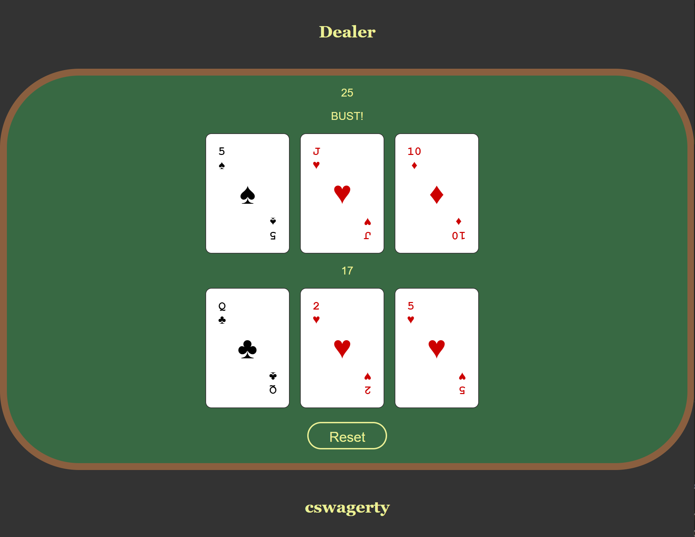

# React/Redux Blackjack

<a href="https://react-redux-blackjack.azurewebsites.net/">Play the live demo</a>

## Overview

React/Redux Blackjack is a demonstration of how to build a blackjack game using React/Redux best practices. Users can play against an AI dealer to try to get closer to 21 without going over.

## Technical hightlights
- Utilizes advanced React/Redux concepts including reducers, container components, and higher-order components
- Game and display logic are controlled entirely with custom code. React and Redux are the only runtime JS libraries.
- Dealer AI player automatically plays when it is his turn and hits based on casino rules.
- Containerized NodeJS app hosted on Azure App Services at: <a href="https://react-redux-blackjack.azurewebsites.net/">https://react-redux-blackjack.azurewebsites.net/</a>

## Tech stack
- React (JSX)
- Redux (with react-redux bindings)
- Sass
- Webpack
- Node

## Running the app locally

### npm

1. Clone the repo
2. `npm install`
3. `npm run server`
4. go to <a href="http://localhost:3000/">http://localhost:3000/</a>

### Docker Desktop

1. Clone the repo
2. `docker build -t react-redux-blackjack .`
3. `docker run -it -p 3000:3000 react-redux-blackjack`
4. go to <a href="http://localhost:3000/">http://localhost:3000/</a>